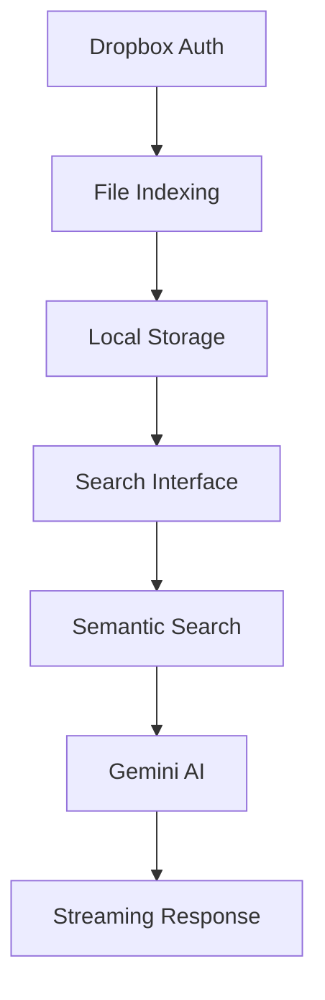

# 🔍 Dropbox AI Search

> **Een krachtige AI-powered zoekapp voor je Dropbox bestanden - Gemaakt door Tom Naberink**

Doorzoek al je Dropbox bestanden met de kracht van Gemini 2.5 Flash AI. Upload, indexeer en stel intelligente vragen over je documenten, code, afbeeldingen en meer!

## ✨ Features

### 🎯 **Core Functionaliteiten**
- 🔐 **Veilige Dropbox Authenticatie**: Direct verbinden met je Dropbox account
- 📁 **Volledige Bestand Indexering**: Alle bestanden worden geanalyseerd en geïndexeerd
- 🤖 **AI-Powered Search**: Stel natuurlijke vragen over je bestanden
- ⚡ **Real-time Streaming**: Live AI responses terwijl je zoekt
- 📊 **Voortgangsindicatoren**: Zie precies hoeveel bestanden er verwerkt zijn

### 📄 **Ondersteunde Bestandstypen**
- **Tekst**: .txt, .md, .csv, .json, .js, .ts, .html, .css, .py, .java, .cpp, .php, .rb, .go, .rs, .swift, .kt, .scala, .sh, .bat, .xml, .yaml, .ini, .log
- **Documenten**: .pdf, .docx, .doc (basis ondersteuning)
- **Afbeeldingen**: .jpg, .jpeg, .png, .gif, .bmp, .webp, .svg (OCR gepland)
- **Data**: Alle tekstgebaseerde bestanden tot 10MB

### 🧪 **Diagnostics & Testing**
- **API Tester**: Test je Gemini en Dropbox API keys
- **Realtime Diagnostics**: Zie direct waar problemen zitten
- **Uitgebreide Error Handling**: Duidelijke foutmeldingen en oplossingen

## 🚀 Quick Start

### Stap 1: Clone & Install
```bash
git clone <repository-url>
cd dropbox-ai-search
npm install
```

### Stap 2: Environment Setup
Maak `.env.local` aan:
```env
GEMINI_API_KEY=your_gemini_api_key_here
```

**API Keys verkrijgen:**
- **Gemini API**: [Google AI Studio](https://makersuite.google.com/app/apikey) (gratis)
- **Dropbox API**: [Dropbox App Console](https://www.dropbox.com/developers/apps) (gratis)

### Stap 3: Start Development
```bash
npm run dev
# Open http://localhost:3000
```

### Stap 4: Setup Dropbox
1. Ga naar [Dropbox App Console](https://www.dropbox.com/developers/apps)
2. Klik "Create app" → "Scoped access" → "Full Dropbox"
3. Geef je app een naam
4. Ga naar Settings → OAuth 2 → "Generate access token"
5. Kopieer de token en plak in de app

### Stap 5: Test & Index
1. **Test je API keys** met de ingebouwde tester
2. **Start indexering** van je Dropbox bestanden
3. **Begin zoeken** met natuurlijke vragen!

## 🔧 Hoe het werkt

### 1. **Bestand Indexering**
```
Dropbox API → Bestanden ophalen → Inhoud extracten → Lokale index opslaan
```
- Alle bestanden worden recursief opgehaald
- Tekstinhoud wordt geëxtraheerd en geïndexeerd
- Voortgang wordt real-time getoond
- Index wordt lokaal opgeslagen in browser

### 2. **AI Search Pipeline**
```
Zoekopdracht → Semantische zoektocht → Relevante bestanden → Gemini AI → Streaming antwoord
```
- Intelligente zoektocht door alle geïndexeerde content
- Relevantie scoring op basis van bestandsnaam, pad en inhoud
- Context wordt meegegeven aan Gemini 2.5 Flash
- Real-time streaming van AI antwoorden

### 3. **Security & Privacy**
- **Lokale opslag**: Alle data blijft in je browser
- **Geen server storage**: Geen bestanden opgeslagen op externe servers
- **Direct API calls**: Rechtstreeks naar Dropbox en Gemini APIs
- **Token beveiliging**: Access tokens alleen lokaal opgeslagen

## 📊 Technical Architecture

### **Frontend Components**
```
DropboxAISearch (Main)
├── DropboxAuth (Authenticatie)
├── APITester (Diagnostics)
├── FileIndexer (Indexering met progress)
├── SearchInterface (AI zoeken)
└── MarkdownRenderer (Response formatting)
```

### **API Endpoints**
| Endpoint | Functie | Input | Output |
|----------|---------|-------|--------|
| `/api/dropbox/test` | Test Dropbox verbinding | `accessToken` | Account info |
| `/api/dropbox/files` | Haal alle bestanden op | `accessToken` | Bestandslijst |
| `/api/dropbox/content` | Download bestandsinhoud | `accessToken`, `filePath` | Tekstinhoud |
| `/api/search` | Zoek in geïndexeerde bestanden | `query`, `fileIndex` | Zoekresultaten |
| `/api/ai-response` | Genereer AI antwoord | `prompt` | Streaming response |
| `/api/test/gemini` | Test Gemini API | `apiKey` (optioneel) | Test resultaat |

### **Data Flow**


## 🎯 Gebruik Voorbeelden

### **Zoek Strategieën**
```
✅ "Wat zijn mijn projectdeadlines?"
✅ "Alle documenten over marketing"
✅ "Vat mijn vergadernotities samen"
✅ "Contactgegevens van klanten"
✅ "Code bestanden met API calls"
✅ "Afbeeldingen van vorige maand"
```

### **Advanced Queries**
```
🔍 "Vergelijk de budgetten in mijn Excel bestanden"
🔍 "Welke bugs zijn er gerapporteerd in mijn logs?"
🔍 "Samenvatting van alle projectdocumentatie"
🔍 "Zoek naar TODO items in mijn code"
```

## 🛠️ Development

### **Project Structure**
```
src/
├── app/
│   ├── api/                    # API routes
│   │   ├── dropbox/           # Dropbox API endpoints
│   │   ├── test/              # Diagnostic endpoints
│   │   ├── search/            # Search functionality
│   │   └── ai-response/       # Gemini AI streaming
│   ├── globals.css            # Styling
│   ├── layout.tsx             # App layout
│   └── page.tsx               # Main page
└── components/
    ├── DropboxAISearch.tsx    # Main component
    ├── DropboxAuth.tsx        # Authentication
    ├── FileIndexer.tsx        # Indexing with progress
    ├── SearchInterface.tsx    # AI search interface
    ├── APITester.tsx          # Diagnostics
    └── MarkdownRenderer.tsx   # Response formatting
```

### **Key Dependencies**
```json
{
  "@google/generative-ai": "^0.21.0",  // Gemini AI
  "dropbox": "^10.34.0",               // Dropbox API
  "next": "15.3.3",                    // Framework
  "react": "^18.3.1",                  // UI
  "tailwindcss": "^3.4.17"             // Styling
}
```

### **Environment Variables**
```env
# Required
GEMINI_API_KEY=your_gemini_api_key

# Optional (for diagnostics)
NEXT_PUBLIC_HAS_GEMINI_KEY=true
```

## 🚨 Troubleshooting

### **Veelvoorkomende Problemen**

#### ❌ "Gemini API Key niet gevonden"
**Oplossing:**
1. Check `.env.local` bestand bestaat
2. Controleer `GEMINI_API_KEY=your_actual_key`
3. Restart development server
4. Test API key in [Google AI Studio](https://makersuite.google.com/app/apikey)

#### ❌ "Dropbox Access Token ongeldig"
**Oplossing:**
1. Genereer nieuwe token in [Dropbox App Console](https://www.dropbox.com/developers/apps)
2. Check app permissions (Full Dropbox access)
3. Kopieer token exact (geen extra spaties)
4. Test met API Tester in de app

#### ❌ "Indexering faalt"
**Oplossing:**
1. Check internetverbinding
2. Controleer Dropbox API quota
3. Probeer kleinere batch sizes
4. Check browser console voor details

#### ❌ "Zoeken geeft geen resultaten"
**Oplossing:**
1. Controleer of indexering voltooid is
2. Probeer bredere zoektermen
3. Check of bestanden tekstinhoud hebben
4. Herindexeer indien nodig

### **Performance Tips**
- **Grote accounts**: Indexering kan lang duren (1000+ bestanden)
- **Memory usage**: Browser kan traag worden met veel bestanden
- **API limits**: Dropbox heeft rate limiting
- **File sizes**: Bestanden >10MB worden overgeslagen

## 🔒 Security & Privacy

### **Data Handling**
- ✅ **Lokale opslag**: Alle geïndexeerde data blijft in je browser
- ✅ **Geen tracking**: Geen analytics of user tracking
- ✅ **Direct APIs**: Rechtstreeks naar Dropbox/Gemini, geen tussenservers
- ✅ **Token beveiliging**: Access tokens alleen lokaal opgeslagen

### **Permissions**
- **Dropbox**: Alleen lezen van bestanden (geen schrijftoegang)
- **Gemini**: Alleen AI text generation (geen data opslag)
- **Browser**: LocalStorage voor index en tokens

## 🎯 Roadmap

### **Geplande Features**
- [ ] **PDF Text Extraction**: Volledige PDF inhoud indexering
- [ ] **DOCX Support**: Microsoft Word document parsing
- [ ] **OCR voor Afbeeldingen**: Tekst extractie uit afbeeldingen
- [ ] **Advanced Filters**: Filter op bestandstype, datum, grootte
- [ ] **Export Functionaliteit**: Zoekresultaten exporteren
- [ ] **Bulk Operations**: Meerdere bestanden tegelijk verwerken
- [ ] **Smart Suggestions**: AI-powered zoeksuggesties
- [ ] **Collaboration**: Delen van zoekresultaten

### **Technical Improvements**
- [ ] **Incremental Indexing**: Alleen nieuwe/gewijzigde bestanden
- [ ] **Background Processing**: Indexering in web workers
- [ ] **Caching Strategy**: Intelligente cache invalidation
- [ ] **Error Recovery**: Automatisch hervatten na fouten
- [ ] **Performance Monitoring**: Real-time performance metrics

## 🤝 Contributing

### **Development Setup**
```bash
# Clone repository
git clone <repository-url>
cd dropbox-ai-search

# Install dependencies
npm install

# Setup environment
cp .env.example .env.local
# Add your API keys

# Start development
npm run dev
```

### **Code Style**
- **TypeScript**: Strict typing required
- **React Hooks**: Functional components only
- **Tailwind CSS**: Utility-first styling
- **Error Handling**: Comprehensive try/catch blocks
- **Comments**: Document complex logic

## 📚 Resources & Links

### **API Documentation**
- [Dropbox API v2](https://www.dropbox.com/developers/documentation/http/documentation) - File operations
- [Gemini API](https://ai.google.dev/docs) - AI text generation
- [Next.js 15](https://nextjs.org/docs) - Framework documentation

### **Getting API Keys**
- [Gemini API Key](https://makersuite.google.com/app/apikey) - Google AI Studio
- [Dropbox App Console](https://www.dropbox.com/developers/apps) - Create Dropbox app

### **Community & Support**
- [GitHub Repository](https://github.com/TomNaberink/dropbox-ai-search) - Source code & issues
- [Tom Naberink LinkedIn](https://linkedin.com/in/tomnaberink) - Direct contact

---

## 🎉 **Ready to Search Your Dropbox with AI?**

Deze app geeft je de kracht om je volledige Dropbox te doorzoeken met natuurlijke taal. Van documenten tot code, van afbeeldingen tot data - alles wordt doorzoekbaar met AI!

**🚀 Start nu en ontdek wat er in je bestanden verborgen zit!**

**💜 Gemaakt met passie door Tom Naberink**  
**🤖 Powered by Gemini 2.5 Flash & Dropbox API**

---

*Dropbox AI Search v1.0*  
*Last updated: December 2024*